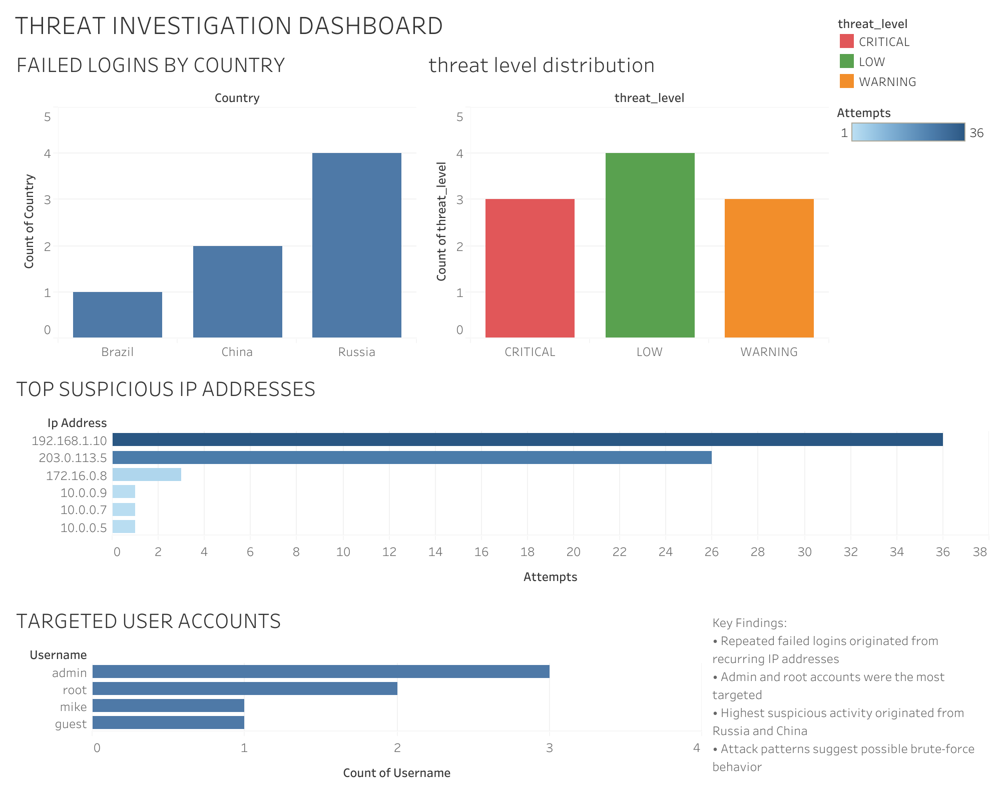

# Suspicious Login & IP Threat Investigation Using SQL

## Overview

This project simulates a real-world Security Operations Center (SOC) investigation using SQL to analyze login authentication activity and identify suspicious behavior patterns.

The investigation focuses on:

* repeated failed login attempts
* suspicious IP address activity
* targeted user accounts
* geographic risk indicators
* potential brute-force behavior

The goal of this project is to demonstrate how SQL can be used for security analytics, threat detection, and behavioral investigation.

⸻

## Objectives

* Detect repeated failed login attempts
* Identify suspicious IP addresses targeting multiple accounts
* Analyze high-risk login activity by country
* Classify potentially malicious behavior using SQL logic
* Simulate analyst-style investigation workflows

⸻

## Tools & Technologies

* SQL
* CSV dataset analysis
* Aggregation functions (COUNT, GROUP BY)
* Conditional logic (CASE WHEN)
* Filtering (WHERE, HAVING)
* Analytical sorting (ORDER BY)

____

## Project Structure

sql-threat-investigation-system/
│
├── advanced_login_data.csv
├── queries.sql
├── insights.md
├── README.md
└── dashboard_screenshots/

____

## Dataset Overview

The dataset contains simulated authentication logs with:

	•	timestamps
	•	usernames
	•	IP addresses
	•	login status
	•	attempt counts
	•	country of origin

____

### Example Field

Column	Description
timestamp	Login event time
username	Targeted account
ip_address	Source IP address
status	SUCCESS or FAILED
attempts	Number of login attempts
country	Geographic source

____

## Investigation Queries

### 1. Failed Login Attempts by IP Address

Identifies IP addresses responsible for repeated authentication failures.

SELECT ip_address,
       COUNT(*) AS failed_attempts
FROM logins
WHERE status = 'FAILED'
GROUP BY ip_address
ORDER BY failed_attempts DESC;

____

### 2. Most Frequently Targeted Accounts

Detects accounts receiving repeated failed login attempts.

SELECT username,
       COUNT(*) AS failed_logins
FROM logins
WHERE status = 'FAILED'
GROUP BY username
ORDER BY failed_logins DESC;

____

### 3. Suspicious Activity by Country

Analyzes geographic sources associated with failed login activity.

SELECT country,
       COUNT(*) AS suspicious_activity
FROM logins
WHERE status = 'FAILED'
GROUP BY country
ORDER BY suspicious_activity DESC;

____

### 4. IP Threat Classification

Classifies IP addresses based on failed login frequency.

SELECT ip_address,
       COUNT(*) AS failed_attempts,
       CASE
           WHEN COUNT(*) >= 4 THEN 'CRITICAL'
           WHEN COUNT(*) >= 2 THEN 'WARNING'
           ELSE 'LOW'
       END AS threat_level
FROM logins
WHERE status = 'FAILED'
GROUP BY ip_address
ORDER BY failed_attempts DESC;

____

### 5. Multiple Account Targeting Detection

Detects IP addresses attempting to access multiple user accounts.

SELECT ip_address,
       COUNT(DISTINCT username) AS targeted_users
FROM logins
WHERE status = 'FAILED'
GROUP BY ip_address
ORDER BY targeted_users DESC;

____

### 6. High-Risk IP Filtering

Filters IP addresses with elevated failed login activity.

SELECT ip_address,
       COUNT(*) AS failed_attempts
FROM logins
WHERE status = 'FAILED'
GROUP BY ip_address
HAVING COUNT(*) >= 3
ORDER BY failed_attempts DESC;

____

### 7. Failed Login Timeline Analysis

Reconstructs suspicious login activity chronologically.

SELECT timestamp,
       username,
       ip_address
FROM logins
WHERE status = 'FAILED'
ORDER BY timestamp ASC;

____

## Key Findings
### Suspicious IP Activity
Multiple failed login attempts originated from recurring IP addresses, particularly:
	•	192.168.1.10
	•	203.0.113.5
These IPs targeted multiple accounts and generated repeated authentication failures.


⸻


### High-Value Account Targeting
The accounts most frequently targeted were:
	•	admin
	•	root
These accounts are commonly associated with elevated privileges and are often targeted during unauthorized access attempts.


⸻


### Geographic Risk Indicators
The highest concentration of failed login activity originated from:
	•	Russia
	•	China
While geographic origin alone does not confirm malicious intent, repeated failed authentication activity from these regions may justify additional monitoring.


⸻


### Threat Pattern Observations
The investigation identified behavior patterns consistent with:
	•	brute-force attempts
	•	repeated password guessing
	•	targeted account attacks
	•	recurring IP-based login failures

_____

## Project Preview

_____

## Skills Demonstrated

	•	Security log analysis
	•	SQL-based threat investigation
	•	Behavioral pattern analysis
	•	Threat classification logic
	•	Data interpretation and reporting
	•	SOC-style analytical thinking

## Author Note

This project is part of a self-built learning roadmap focused on:

	•	SQL analytics
	•	Python programming
	•	statistics fundamentals
	•	cybersecurity investigations
	•	security data analytics

